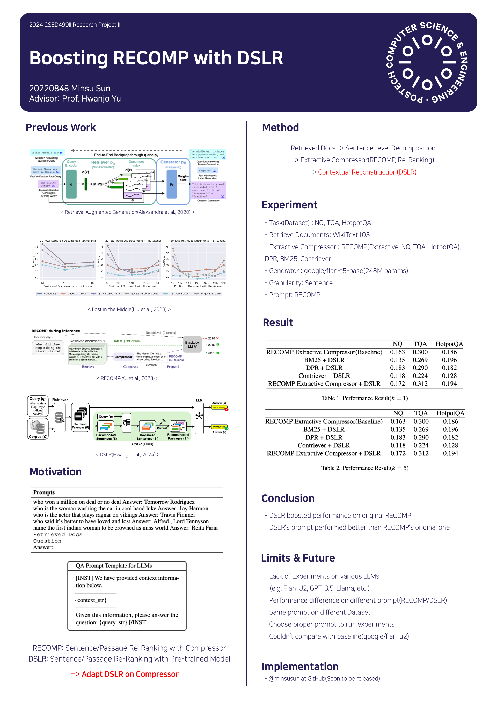

# Boosting RECOMP with DSLR

*(Forked from original [RECOMP repository](https://github.com/carriex/recomp))*

Proposed as the topic of Research Project II(CSED499II) in department of Computer Science and Engineering @ POSTECH

For further information or any issues, please leave an issue on this repository

Try it with [QuickStart](./quickstart.md)!

